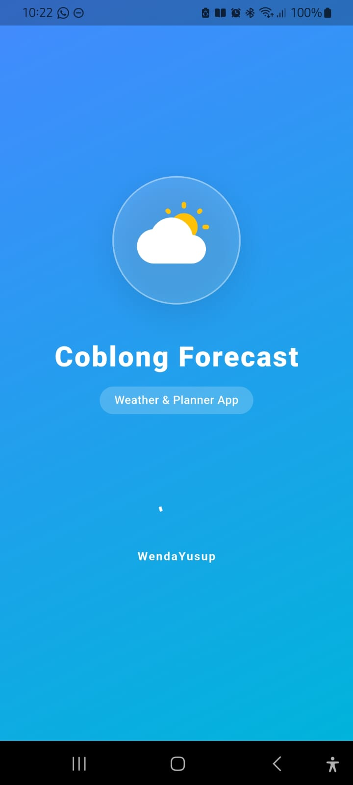
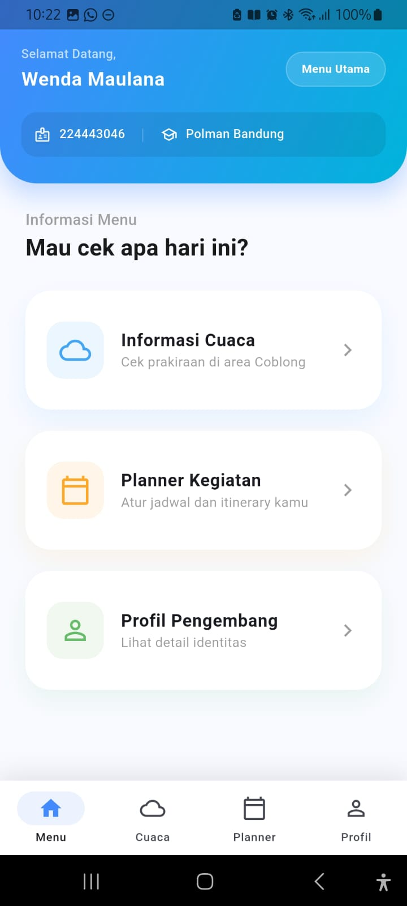
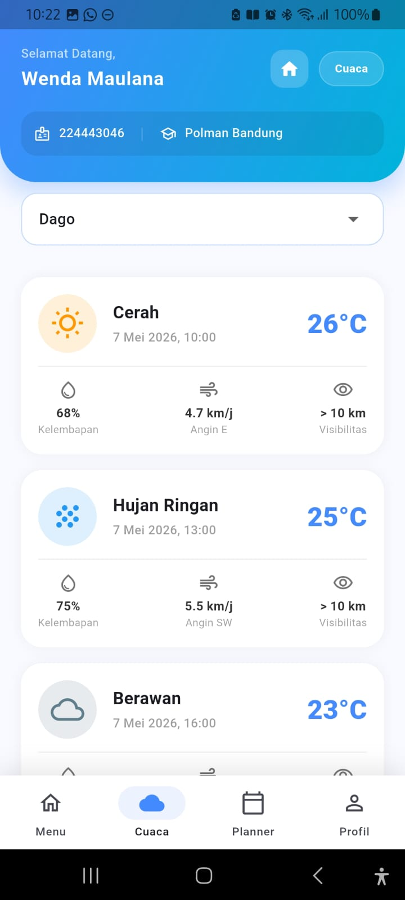
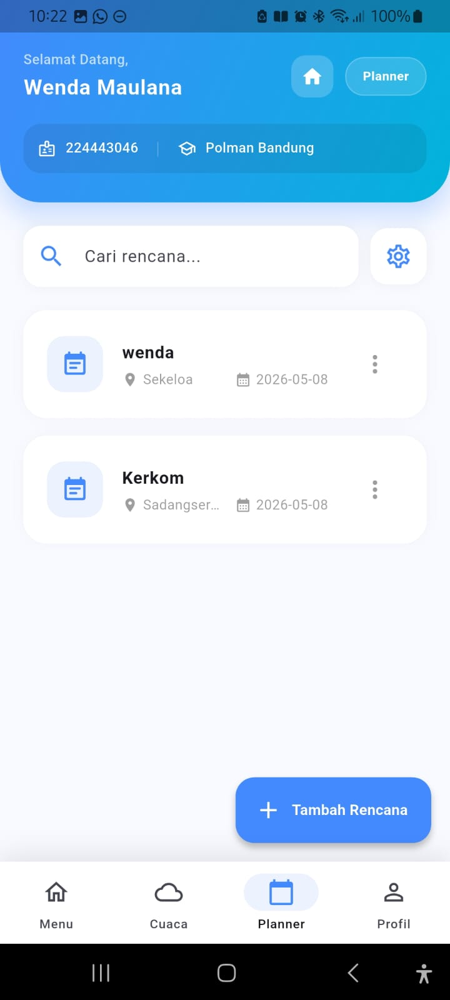
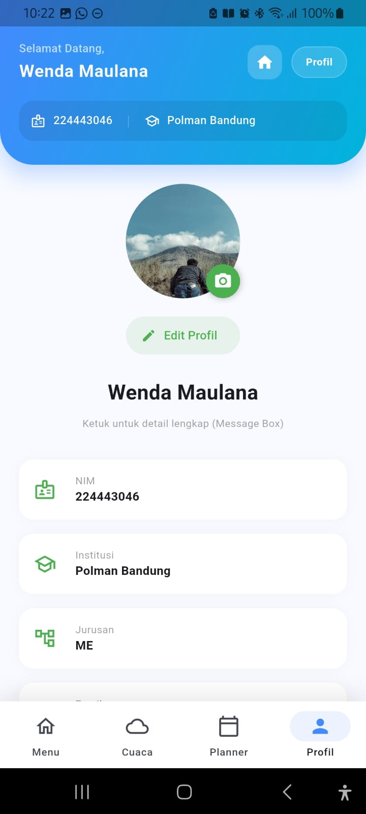

# Coblong Forecast

**Coblong Forecast** adalah aplikasi mobile berbasis Flutter yang dirancang untuk membantu warga atau pengunjung di wilayah Coblong (dan sekitarnya) dalam memantau prakiraan cuaca sekaligus merencanakan kegiatan harian mereka melalui fitur *Itinerary Planner*.

Aplikasi ini dibuat sebagai bagian dari tugas besar / mini project pengembangan aplikasi mobile.

## Fitur Utama

- **Prakiraan Cuaca Real-time**: Pantau kondisi cuaca di berbagai lokasi strategis di Coblong (seperti Dago, Sekeloa, Sadang Serang, dll).
- **Itinerary Planner (CRUD)**: Kelola rencana perjalanan atau kegiatan harian kamu. Kamu bisa menambah, melihat, mengedit, dan menghapus rencana kegiatan.
- **Dynamic API Config**: Pengaturan IP API yang dinamis memudahkan aplikasi untuk terhubung ke server lokal (XAMPP) dengan cepat.
- **Profil Pengguna**: Halaman profil yang bersih dengan integrasi penyimpanan data lokal.
- **Desain Modern & Responsif**: Antarmuka pengguna yang elegan, menggunakan navigasi bawah yang intuitif dan skema warna yang nyaman di mata.

## Teknologi yang Digunakan

- **Frontend**: [Flutter](https://flutter.dev/) (Dart)
- **Backend**: PHP (Native API)
- **Database**: MySQL
- **State Management**: Clean Flutter State Management
- **Networking**: Http Package

## Cara Instalasi

1. **Clone Repository**
   ```bash
   git clone https://github.com/wendayusup/CoblongForecast.git
   ```

2. **Setup Backend**
   - Pastikan XAMPP kamu menyala (Apache & MySQL).
   - Masukkan folder API PHP kamu ke dalam `htdocs`.
   - Import database `.sql` yang telah disediakan.

3. **Install Dependencies**
   ```bash
   flutter pub get
   ```

4. **Konfigurasi IP**
   - Buka aplikasi, masuk ke menu **Planner**.
   - Klik ikon settings di pojok kanan atas.
   - Masukkan IP Address laptop kamu (contoh: `192.168.1.10`).

5. **Run Project**
   ```bash
   flutter run
   ```

## Screenshots

| Splash Screen | Menu Utama | Weather Detail | Planner | Profil |
|---|---|---|---|---|
|  |  |  |  |  |

*(Gambar diambil langsung dari aplikasi Coblong Forecast)*

## Developer

- **Nama**: Wenda Maulana
- **NIM**: 224443046
- **Instansi**: Polman Bandung
- **Jurusan**: Teknik Otomasi Manufaktur & Mekatronika

---

Made with by Wenda Yusup
